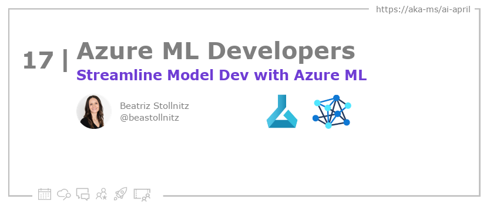
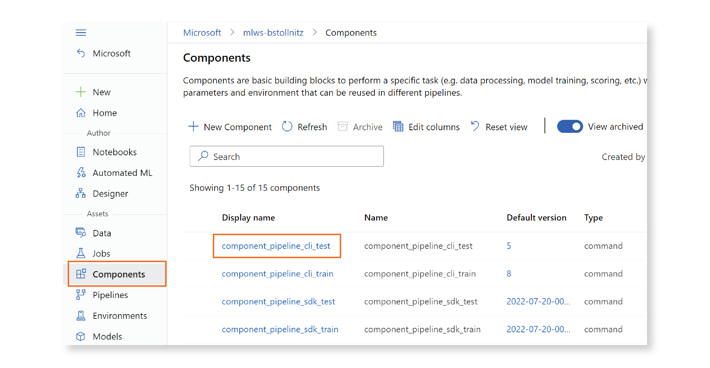

<head>

  <link rel="canonical" href="https://bea.stollnitz.com/blog/aml-pipeline/"  />

</head>

- 📧 [Sign up for the Azure AI Developer Newsletter](https://aka.ms/azure-ai-dev-newsletter)
- 📰 [Subscribe to the #30DaysOfAzureAI RSS feed](https://azureaidevs.github.io/hub/blog/rss.xml)
- 📌 [Ask a question about this post on GitHub Discussions](https://github.com/AzureAiDevs/hub/discussions/categories/17-streamline-model-dev-with-azure-ml)
- 💡 [Suggest a topic for a future post](https://github.com/AzureAiDevs/hub/discussions/categories/call-for-content)

## Day _17_ of #30DaysOfAzureAI

<!-- README
The following description is also used for the tweet. So it should be action oriented and grab attention 
If you update the description, please update the description: in the frontmatter as well.
-->

**Streamlining ML Development with Azure ML Components & Pipelines**

<!-- README
The following is the intro to the post. It should be a short teaser for the post.
-->

Take your machine learning projects to new heights with Azure ML components and pipelines! Learn how to break down code, connect components, and use the CLI or Python SDK. Organize work into two steps with Azure ML components and boost accuracy with frequent testing. Get started with detailed examples and enjoy logging support from the MLflow API. Unleash the full potential of your machine learning projects with this informative article.

## What we'll cover

<!-- README
The following list is the main points of the post. There should be 3-4 main points.
 -->

1. Azure ML components and pipelines can help organize machine learning projects.
2. Two GitHub repositories are available for working with components and pipelines using the CLI or Python SDK.
3. The MLflow API provides logging support, and the authors encourage frequent testing to streamline the machine learning process.

<!-- 
- Main point 1
- Main point 2
- Main point 3 
- Main point 4
-->

<!-- README
Add or update a list relevant references here. These could be links to other blog posts, Microsoft Learn Module, videos, or other resources.
-->

### References

- [Learn Module: Introduction to Azure Machine Learning](https://learn.microsoft.com/training/modules/intro-to-azure-ml?WT.mc_id=aiml-89446-dglover)
- [What is Azure Machine Learning?](https://learn.microsoft.com/azure/machine-learning/overview-what-is-azure-machine-learning?WT.mc_id=aiml-89446-dglover)

<!-- README
The following is the body of the post. It should be an overview of the post that you are referencing.
See the Learn More section, if you supplied a canonical link, then will be displayed here.
-->

This article discusses the benefits of Azure ML components and pipelines in machine learning. It explains how to break down training code into components and connect those components into a pipeline. The author provides two GitHub repositories to illustrate how to work with pipelines and components using the CLI and the Python SDK. The article also emphasizes the importance of organizing work into two steps, i.e., a training step and a test step.

The author also discusses creating Azure ML components as reusable pieces of code with inputs and outputs, which can be defined in their Python file. Inputs and outputs are specified as command-line arguments. The author further highlights that components can help maintain separation in the cloud by organizing training code into two steps with distinct logic. Lastly, the article provides an example of a train component specification that shows the names of the input and output in the component YAML specification match the names of the arguments in the code.

The article emphasizes the importance of testing the code frequently to ensure it executes and provides accurate results. It also recommends using the MLflow API because of the great logging support it provides.

## Learn More

To learn more, check out this [article](https://bea.stollnitz.com/blog/aml-pipeline/).

## Questions?

[Remember, you can ask a question about this post on GitHub Discussions](https://github.com/AzureAiDevs/Discussions/discussions/categories/17-streamline-model-dev-with-azure-ml)