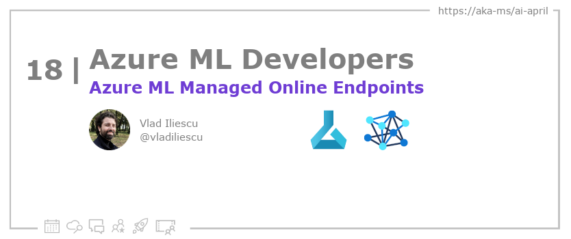

<head>  

  <link rel="canonical" href="https://vladiliescu.net/aml-managed-endpoints-quickstart/"  />

</head>

- 📧 [Sign up for the Azure AI Developer Newsletter](https://aka.ms/azure-ai-dev-newsletter)
- 📰 [Subscribe to the #30DaysOfAzureAI RSS feed](https://azureaidevs.github.io/hub/blog/rss.xml)
- 📌 [Ask a question about this post on GitHub Discussions](https://github.com/AzureAiDevs/hub/discussions/categories/18-azure-ml-managed-online-endpoints)
- 💡 [Suggest a topic for a future post](https://github.com/AzureAiDevs/hub/discussions/categories/call-for-content)

## 🗓️ Day _18_ of #30DaysOfAzureAI

<!-- README
The following description is also used for the tweet. So it should be action oriented and grab attention 
If you update the description, please update the description: in the frontmatter as well.
-->

**Azure ML Managed Online Endpoints - A Quickstart**

<!-- README
The following is the intro to the post. It should be a short teaser for the post.
-->

Yesterday we learned how to streamline ML Development with Azure ML. Today, we'll learn how to deploy ML models using Azure ML managed online endpoints.

## 🎯 What we'll cover

<!-- README
The following list is the main points of the post. There should be 3-4 main points.
 -->

1. What are Azure ML managed online endpoints.
2. The three main components of an online endpoint.
3. How to deploy one or more models under the same endpoint.

<!-- 
- Main point 1
- Main point 2
- Main point 3 
- Main point 4
-->

<!-- README
Add or update a list relevant references here. These could be links to other blog posts, Microsoft Learn Module, videos, or other resources.
-->

## 📚 References

- [Learn Module: Introduction to Azure Machine Learning](https://learn.microsoft.com/training/modules/intro-to-azure-ml?WT.mc_id=aiml-89446-dglover)
- [What is Azure Machine Learning?](https://learn.microsoft.com/azure/machine-learning/overview-what-is-azure-machine-learning?WT.mc_id=aiml-89446-dglover)

<!-- README
The following is the body of the post. It should be an overview of the post that you are referencing.
See the Learn More section, if you supplied a canonical link, then will be displayed here.
-->

## 🚌 Get started with Azure ML's managed online endpoints

[Today's article](https://vladiliescu.net/aml-managed-endpoints-quickstart/) discusses the benefits of using Azure Machine Learning's managed online endpoints and compares them to Azure Container Instances. The author outlines three main reasons why they prefer managed online endpoints: built-in security, native blue/green deployments, and auto-scaling with Azure Monitor.

Step-by-step instructions are provided for for deploying an online endpoint that translates API inputs to something a machine learning model can handle, invokes the model, and returns formatted results.

## 👓 Read today's article

Today's [article](https://vladiliescu.net/aml-managed-endpoints-quickstart/).

## 🙋🏾‍♂️ Questions?

[Remember, you can ask a question about this post on GitHub Discussions](https://github.com/AzureAiDevs/Discussions/discussions/categories/18-azure-ml-managed-online-endpoints)