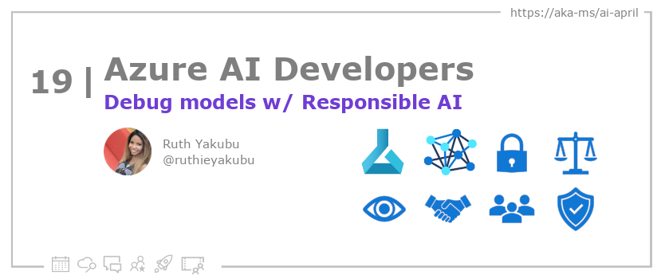

<head>

  <link rel="canonical" href="https://techcommunity.microsoft.com/t5/ai-machine-learning-blog/getting-started-with-azure-machine-learning-responsible-ai/ba-p/3746948"  />

</head>

- 📧 [Sign up for the Azure AI Developer Newsletter](https://aka.ms/azure-ai-dev-newsletter)
- 📰 [Subscribe to the #30DaysOfAzureAI RSS feed](https://azureaidevs.github.io/hub/blog/rss.xml)
- 📌 [Ask a question about this post on GitHub Discussions](https://github.com/AzureAiDevs/hub/discussions/categories/19-debug-models-w/-responsible-ai)
- 💡 [Suggest a topic for a future post](https://github.com/AzureAiDevs/hub/discussions/categories/call-for-content)

## Day _19_ of #30DaysOfAzureAI

<!-- README
The following description is also used for the tweet. So it should be action oriented and grab attention 
If you update the description, please update the description: in the frontmatter as well.
-->

**Guide to analyzing ML models for Responsible AI issues (Part 1)**

<!-- README
The following is the intro to the post. It should be a short teaser for the post.
-->

The Responsible AI (RAI) Dashboard is a set of open-source tools for creating responsible AI models available on the Azure Machine Learning platform. It includes components for data analysis, model troubleshooting, fairness evaluation, and causal relationship exploration. To use the RAI Dashboard, a user needs an Azure Machine Learning workspace and can refer to a tutorial using the Diabetes Hospital Readmission dataset.

## What we'll cover

<!-- README
The following list is the main points of the post. There should be 3-4 main points.
 -->

- The RAI Dashboard is a suite of open-source tools for responsible AI development, including features like model interpretability, error analysis, and counterfactual analysis.
- The RAI Dashboard is accessible via the Azure Machine Learning platform.
- RAI components help ML engineers and decision-makers improve AI responsibility.

<!-- 
- Main point 1
- Main point 2
- Main point 3 
- Main point 4
-->

<!-- README
Add or update a list relevant references here. These could be links to other blog posts, Microsoft Learn Module, videos, or other resources.
-->

### References

- [Microsoft's approach to using AI responsibly](https://news.microsoft.com/source/features/ai/microsoft-approach-to-ai/#using-ai-responsibly?WT.mc_id=aiml-89446-dglover)
- [Meeting the AI moment: advancing the future through responsible AI](https://blogs.microsoft.com/on-the-issues/2023/02/02/responsible-ai-chatgpt-artificial-intelligence?WT.mc_id=aiml-89446-dglover)

<!-- README
The following is the body of the post. It should be an overview of the post that you are referencing.
See the Learn More section, if you supplied a canonical link, then will be displayed here.
-->

## What is Responsible AI Dashboard?

The Responsible AI (RAI) Dashboard is a suite of open-source tools that help developers create responsible AI models with features such as model statistics, data explorer, error analysis, model interpretability, counterfactual analysis, and causal inference. The dashboard is built on leading open-source tools such as ErrorAnalysis, InterpretML, Fairlearn, DiCE, and EconML, and it can be accessed through the Azure Machine Learning platform. The RAI components allow developers to troubleshoot and analyze models and make better decisions to produce more responsible AI systems.

InterpretML, Fairlearn, DiCE, and EconML are some of the open-source tools that power the RAI dashboard. InterpretML provides data scientists and AI developers access to state-of-the-art glassbox and opaquebox interpretability models, helping them better understand how their models are making predictions. Fairlearn helps identify fairness issues and covers a set of state-of-the-art mitigation algorithms to address them. DiCE outputs counterfactual datapoints that are similar to the input but with different outcomes, helping ML engineers and business decision-makers generate alternative datapoints. EconML helps business decision-makers explore causal relationships between factors and real-world outcomes.

The RAI dashboard is available as part of the Responsible AI Toolbox via open source or in the Azure Machine Learning platform. It allows ML engineers to analyze models and make better decisions to produce more responsible AI systems. The dashboard can be accessed through the Azure Machine Learning platform, eliminating the need to use open-source libraries separately to troubleshoot model performance, reliability, or fairness in disparate code instances. The tutorial walks users through creating an Azure Machine Learning workspace and using RAI components for further analysis and debugging of a model trained on the Diabetes Hospital Readmission dataset.

## Learn More

To learn more, check out this [article](https://techcommunity.microsoft.com/t5/ai-machine-learning-blog/getting-started-with-azure-machine-learning-responsible-ai/ba-p/3746948).

## Questions?

[Remember, you can ask a question about this post on GitHub Discussions](https://github.com/AzureAiDevs/Discussions/discussions/categories/19-debug-models-w/-responsible-ai)