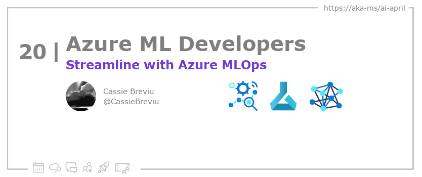

<head>

  <meta property="og:url" content="https://azureaidevs.github.io/hub/blog/2023-day20" />
  <meta property="og:title" content="Learn MLOps for the ML Lifecycle" />
  <meta property="og:description" content="Learn about Azure Machine Learning lifecycle and open source tooling to start building MLOps https://azureaidevs.github.io/hub/blog/2023-day20 #30DaysOfAzureAI #AzureAiDevs #AI #AzureMLOps" />
  <meta property="og:image" content="https://azureaidevs.github.io/hub/img/2023/banner-day20.png" />
  <meta property="og:type" content="article" />
  <meta property="og:site_name" content="Azure AI Developer" />
  

  <link rel="canonical" href="https://learn.microsoft.com/events/ignite-2022/cll99-learn-live-start-machine-learning-lifecycle-with-mlops"  />

</head>

- 📧 [Sign up for the Azure AI Developer Newsletter](https://aka.ms/azure-ai-dev-newsletter)
- 📰 [Subscribe to the #30DaysOfAzureAI RSS feed](https://azureaidevs.github.io/hub/blog/rss.xml)
- 📌 [Ask a question about this post on GitHub Discussions](https://github.com/AzureAiDevs/hub/discussions/categories/20-learn-mlops-for-the-ml-lifecycle)
- 💡 [Suggest a topic for a future post](https://github.com/AzureAiDevs/hub/discussions/categories/call-for-content)

## Day _20_ of #30DaysOfAzureAI

<!-- README
The following description is also used for the tweet. So it should be action oriented and grab attention 
If you update the description, please update the description: in the frontmatter as well.
-->

**Learn about Azure Machine Learning lifecycle and open source tooling to start building MLOps**

<!-- README
The following is the intro to the post. It should be a short teaser for the post.
-->

Yesterday we learned about the Azure ML Responsible AI Dashboard. Today is an introduction to Azure MLOps, where you'll learn how to "productionalize" ML models with Azure ML.

## What we'll cover

<!-- README
The following list is the main points of the post. There should be 3-4 main points.
 -->

The three main points covered are:
1. Identifying the different steps of the ML lifecycle
2. Describing how to create and manage machine learning models using MLOps processes
3. Articulating processes to monitor models and respond to incidents.

<!-- 
- Main point 1
- Main point 2
- Main point 3 
- Main point 4
-->

<!-- README
Add or update a list relevant references here. These could be links to other blog posts, Microsoft Learn Module, videos, or other resources.
-->

### References

- [Machine learning operations (MLOps)](https://azure.microsoft.com/products/machine-learning/mlops/#features?WT.mc_id=aiml-89446-dglover)
- [Learn Module: Introduction to machine learning operations (MLOps)](https://learn.microsoft.com/training/paths/introduction-machine-learn-operations?WT.mc_id=aiml-89446-dglover)
- [Learn Module: Start the machine learning lifecycle with MLOps](https://learn.microsoft.com/training/modules/start-ml-lifecycle-mlops?WT.mc_id=aiml-89446-dglover)

<!-- README
The following is the body of the post. It should be an overview of the post that you are referencing.
See the Learn More section, if you supplied a canonical link, then will be displayed here.
-->

## Watch the Learn Live MLOps for the ML Lifecycle Session

<iframe width="100%" height="420" src="https://www.youtube.com/embed/MYP3Bmsncq4" title="YouTube video player" frameborder="0" allow="accelerometer; autoplay; clipboard-write; encrypted-media; gyroscope; picture-in-picture; web-share" allowfullscreen></iframe>

## Learn More

To learn more, check out this [article](https://learn.microsoft.com/events/ignite-2022/cll99-learn-live-start-machine-learning-lifecycle-with-mlops).

## Questions?

[Remember, you can ask a question about this post on GitHub Discussions](https://github.com/AzureAiDevs/Discussions/discussions/categories/20-learn-mlops-for-the-ml-lifecycle)