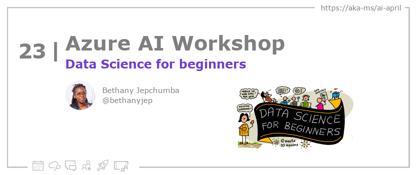

<head>

  <meta property="og:url" content="https://azureaidevs.github.io/hub/blog/2023-day23" />
  <meta property="og:title" content="Data Science for beginners" />
  <meta property="og:description" content="Foundations of Data Science: Workshops for Beginners https://azureaidevs.github.io/hub/blog/2023-day23 #30DaysOfAzureAI #AzureAiDevs #AI #DataScience" />
  <meta property="og:image" content="https://azureaidevs.github.io/hub/img/2023/banner-day23.png" />
  <meta property="og:type" content="article" />
  <meta property="og:site_name" content="Azure AI Developer" />
  

  <link rel="canonical" href="https://microsoft.github.io/Data-Science-For-Beginners"  />

</head>

- 📧 [Sign up for the Azure AI Developer Newsletter](https://aka.ms/azure-ai-dev-newsletter)
- 📰 [Subscribe to the #30DaysOfAzureAI RSS feed](https://azureaidevs.github.io/hub/blog/rss.xml)
- 📌 [Ask a question about this post on GitHub Discussions](https://github.com/AzureAiDevs/hub/discussions/categories/23-data-science-for-beginners)
- 💡 [Suggest a topic for a future post](https://github.com/AzureAiDevs/hub/discussions/categories/call-for-content)

## Day _23_ of #30DaysOfAzureAI

<!-- README
The following description is also used for the tweet. So it should be action oriented and grab attention 
If you update the description, please update the description: in the frontmatter as well.
-->

**Foundations of Data Science: Workshops for Beginners**

<!-- README
The following is the intro to the post. It should be a short teaser for the post.
-->

Yesterday we learned about the Azure MLOps (v2) Solution Accelerator. Today is for folk starting on their Data Science journey. Data Science for Beginners Curriculum is a 10-week, 20-lesson course, so dive in!

## What we'll cover

<!-- README
The following list is the main points of the post. There should be 3-4 main points.
 -->

1. Microsoft's Data Science course is for beginners through project-based lessons and quizzes. 
2. The course covers basic data science principles, including ethics, preparation and visualization. 
3. Feedback is encouraged and further study is recommended through Microsoft Learn.

<!-- 
- Main point 1
- Main point 2
- Main point 3 
- Main point 4
-->

<!-- README
Add or update a list relevant references here. These could be links to other blog posts, Microsoft Learn Module, videos, or other resources.
-->

### References

- [learn Module: Understand data science for machine learning](https://learn.microsoft.com/training/paths/understand-machine-learning?WT.mc_id=aiml-89446-dglover)

<!-- README
The following is the body of the post. It should be an overview of the post that you are referencing.
See the Learn More section, if you supplied a canonical link, then will be displayed here.
-->

Microsoft has introduced a 10-week, 20-lesson course on Data Science for Beginners, which includes pre-lesson and post-lesson quizzes, written instructions to complete each lesson, a solution, and an assignment. It has been developed with a project-based pedagogy to help students learn while building, with a low-stakes quiz before a class to set the intention of the student towards learning a topic. The course covers basic principles of data science, including ethical concepts, data preparation, data visualization, data analysis, real-world use cases of data science, and more. The projects start small and become increasingly complex by the end of the 10 week cycle. Microsoft suggests forming a study group with friends to go through the content together or taking the course in whole or in part.

The course includes lessons on defining data science, data science ethics, statistics and probability, working with relational and non-relational data, using Python, data preparation, data visualization, machine learning, and deep learning. There are also optional sketchnotes and supplemental videos, and each lesson includes a challenge, supplemental reading, and post-lesson quiz. Microsoft encourages teachers to use this curriculum and would love feedback in the discussion forum. Students can fork the entire repo and complete the exercises on their own, and to further their study, Microsoft recommends Microsoft Learn.

## Learn More

To learn more, check out this [article](https://microsoft.github.io/Data-Science-For-Beginners).

## Questions?

[Remember, you can ask a question about this post on GitHub Discussions](https://github.com/AzureAiDevs/Discussions/discussions/categories/23-data-science-for-beginners)