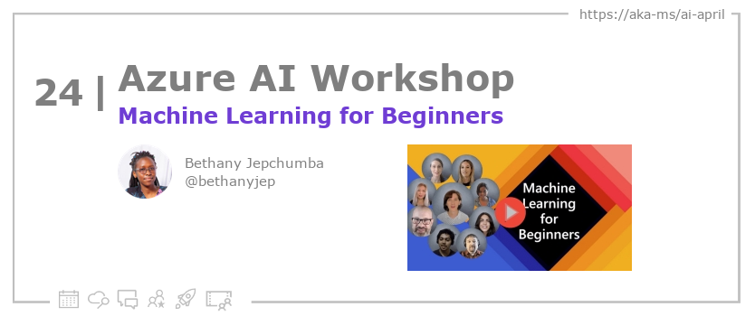

<head>

  <meta property="og:url" content="https://azureaidevs.github.io/hub/blog/2023-day24" />
  <meta property="og:title" content="Machine Learning for Beginners" />
  <meta property="og:description" content="Learn about the Microsoft Machine Learning for Beginners Curriculum https://azureaidevs.github.io/hub/blog/2023-day24 #30DaysOfAzureAI #AzureAiDevs #AI #MachineLearning" />
  <meta property="og:image" content="https://azureaidevs.github.io/hub/img/2023/banner-day24.png" />
  <meta property="og:type" content="article" />
  <meta property="og:site_name" content="Azure AI Developer" />
  

  <link rel="canonical" href="https://microsoft.github.io/ML-For-Beginners/"  />

</head>

- 📧 [Sign up for the Azure AI Developer Newsletter](https://aka.ms/azure-ai-dev-newsletter)
- 📰 [Subscribe to the #30DaysOfAzureAI RSS feed](https://azureaidevs.github.io/hub/blog/rss.xml)
- 📌 [Ask a question about this post on GitHub Discussions](https://github.com/AzureAiDevs/hub/discussions/categories/24-machine-learning-for-beginners)
- 💡 [Suggest a topic for a future post](https://github.com/AzureAiDevs/hub/discussions/categories/call-for-content)

## Day _24_ of #30DaysOfAzureAI

<!-- README
The following description is also used for the tweet. So it should be action oriented and grab attention 
If you update the description, please update the description: in the frontmatter as well.
-->

**Learn about the Microsoft Machine Learning for Beginners Curriculum**

<!-- README
The following is the intro to the post. It should be a short teaser for the post.
-->

Yesterday we learned about Data Science for Beginners Curriculum. Today is for folk starting their ML journey. The Machine Learning for Beginners Curriculum is a 12-week, 26-lesson course, so let's dive in!

## What we'll cover

<!-- README
The following list is the main points of the post. There should be 3-4 main points.
 -->

<!-- 
- Main point 1
- Main point 2
- Main point 3 
- Main point 4
-->

<!-- README
Add or update a list relevant references here. These could be links to other blog posts, Microsoft Learn Module, videos, or other resources.
-->

### References

- [Learn Module: Introduction to AI technology](https://learn.microsoft.com/training/modules/introduction-to-ai-technology?WT.mc_id=aiml-89446-dglover)

<!-- README
The following is the body of the post. It should be an overview of the post that you are referencing.
See the Learn More section, if you supplied a canonical link, then will be displayed here.
-->

## Learn More

To learn more, check out this [article](https://microsoft.github.io/ML-For-Beginners/).

## Questions?

[Remember, you can ask a question about this post on GitHub Discussions](https://github.com/AzureAiDevs/Discussions/discussions/categories/24-machine-learning-for-beginners)