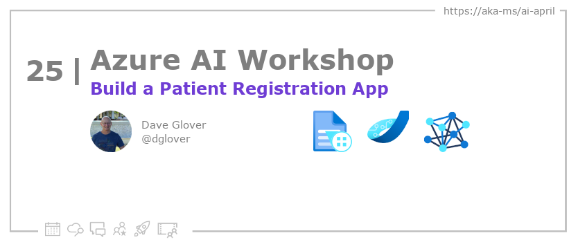

<head>

  <meta property="og:url" content="https://azureaidevs.github.io/hub/blog/2023-day25" />
  <meta property="og:title" content="Build a Patient Registration App" />
  <meta property="og:description" content="Building a Patient Registration Web App with Azure Form Recognizer https://azureaidevs.github.io/hub/blog/2023-day25 #30DaysOfAzureAI #AzureAiDevs #AI #AzureFormRecognizer" />
  <meta property="og:image" content="https://azureaidevs.github.io/hub/img/2023/banner-day25.png" />
  <meta property="og:type" content="article" />
  <meta property="og:site_name" content="Azure AI Developer" />
  

  <link rel="canonical" href="https://newpatiente2e.github.io/docs/"  />

</head>

- 📧 [Sign up for the Azure AI Developer Newsletter](https://aka.ms/azure-ai-dev-newsletter)
- 📰 [Subscribe to the #30DaysOfAzureAI RSS feed](https://azureaidevs.github.io/hub/blog/rss.xml)
- 📌 [Ask a question about this post on GitHub Discussions](https://github.com/AzureAiDevs/hub/discussions/categories/25-build-a-patient-registration-app)
- 💡 [Suggest a topic for a future post](https://github.com/AzureAiDevs/hub/discussions/categories/call-for-content)

## Day _25_ of #30DaysOfAzureAI

<!-- README
The following description is also used for the tweet. So it should be action oriented and grab attention 
If you update the description, please update the description: in the frontmatter as well.
-->

**Building a Patient Registration Web App with Azure Form Recognizer**

<!-- README
The following is the intro to the post. It should be a short teaser for the post.
-->

Transform manual form filling into an automated process with Azure Form Recognizer in this workshop! With Azure services and a focus on improving the patient experience, you'll create a custom model and integrate it into a web-based patient registration system. By the end, you'll have a solution that streamlines the registration process, providing more efficient and accurate data extraction. Don't miss out on harnessing the power of AI with Azure Form Recognizer!

## What we'll cover

<!-- README
The following list is the main points of the post. There should be 3-4 main points.
 -->

- Automate the manual form filling process using Azure Form Recognizer
- Improve the patient experience by integrating a web-based patient registration system
- Achieve a more efficient and accurate system for data extraction with a custom Azure Form Recognizer model. 

<!-- 
- Main point 1
- Main point 2
- Main point 3 
- Main point 4
-->

<!-- README
Add or update a list relevant references here. These could be links to other blog posts, Microsoft Learn Module, videos, or other resources.
-->

### References

- [Learn Module: Azure Form Recognizer Service](https://learn.microsoft.com/training/browse/?expanded=azure&roles=ai-engineer&products=azure-form-recognizer&WT.mc_id=aiml-89446-dglover
- [What is Azure Form Recognizer?](https://learn.microsoft.com/azure/applied-ai-services/form-recognizer/overview?view=form-recog-3.0.0&WT.mc_id=aiml-89446-dglover)
- [Case Study: Powering Speech-to-Text AI that iterates at the speed of business](https://startups.microsoft.com/blog/powering-speech-to-text-ai?WT.mc_id=aiml-89446-dglover)
- [Case study: Duolingo makes learning language fun with help from AI](https://startups.microsoft.com/blog/duolingo-makes-learning-language-fun-with-help-from-ai?WT.mc_id=aiml-89446-dglover)

<!-- README
The following is the body of the post. It should be an overview of the post that you are referencing.
See the Learn More section, if you supplied a canonical link, then will be displayed here.
-->

Are you tired of manually filling out paper-based forms? Do you wish there was a way to automate the process? Look no further than Azure Form Recognizer, a new Cognitive Service that uses machine learning to extract text and table data from form documents. In this workshop, you'll learn how to infuse AI technologies into a web-based patient registration system using Azure services such as Azure Static Web apps, Azure Functions, Azure Cognitive Services, Azure Storage, and Azure Cosmos DB.

The goal of the workshop is to improve the patient experience by automating the paper-based patient registration process at a doctor's surgery. You'll learn how to create a custom Azure Form Recognizer model, integrate it with a web app, and define application roles that map to workshop personas such as surgery admin, nurse, and doctor. By the end of the workshop, you'll have a working solution that allows new patients to complete the registration form online, the web app to extract the data, and the surgery admin to verify and add the registration to the doctor's surgery system. Say goodbye to manual form filling and hello to the power of AI technologies with Azure Form Recognizer!

## Learn More

To learn more, check out this [article](https://newpatiente2e.github.io/docs/).

## Questions?

[Remember, you can ask a question about this post on GitHub Discussions](https://github.com/AzureAiDevs/Discussions/discussions/categories/25-build-a-patient-registration-app)