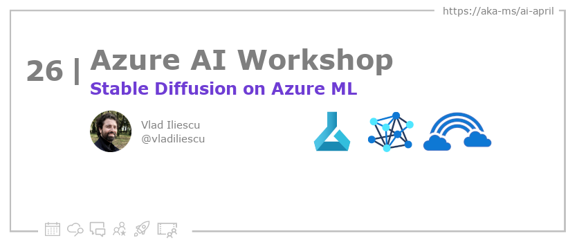

<head>

  <link rel="canonical" href="https://vladiliescu.net/stable-diffusion-web-ui-on-azure-ml/"  />

</head>

- 📧 [Sign up for the Azure AI Developer Newsletter](https://aka.ms/azure-ai-dev-newsletter)
- 📰 [Subscribe to the #30DaysOfAzureAI RSS feed](https://azureaidevs.github.io/hub/blog/rss.xml)
- 📌 [Ask a question about this post on GitHub Discussions](https://github.com/AzureAiDevs/hub/discussions/categories/26-stable-diffusion-on-azure-ml)
- 💡 [Suggest a topic for a future post](https://github.com/AzureAiDevs/hub/discussions/categories/call-for-content)

## Day _26_ of #30DaysOfAzureAI

<!-- README
The following description is also used for the tweet. So it should be action oriented and grab attention 
If you update the description, please update the description: in the frontmatter as well.
-->

**How to run Stable Diffusion Web UI on Azure ML compute instances**

<!-- README
The following is the intro to the post. It should be a short teaser for the post.
-->

"Unlock the full potential of Stable Diffusion with Azure Machine Learning. Discover the comprehensive guide provided by the author on how to create the ideal environment for running this powerful tool. From code snippets to costs, this guide will take you on a journey of discovery and awe."

## What we'll cover

<!-- README
The following list is the main points of the post. There should be 3-4 main points.
 -->

1. A comprehensive guide to run Stable Diffusion on Azure Machine Learning, including prerequisites and costs.
2. Discussion of the author's experience with Stable Diffusion on different GPU types.
3. A journey to unlock the full potential of Stable Diffusion with Azure Machine Learning.

<!-- 
- Main point 1
- Main point 2
- Main point 3 
- Main point 4
-->

<!-- README
Add or update a list relevant references here. These could be links to other blog posts, Microsoft Learn Module, videos, or other resources.
-->

### References

- [Learn Module: Introduction to Azure Machine Learning](https://learn.microsoft.com/training/modules/intro-to-azure-ml?WT.mc_id=aiml-89446-dglover)
- [What is Azure Machine Learning?](https://learn.microsoft.com/azure/machine-learning/overview-what-is-azure-machine-learning?WT.mc_id=aiml-89446-dglover)

<!-- README
The following is the body of the post. It should be an overview of the post that you are referencing.
See the Learn More section, if you supplied a canonical link, then will be displayed here.
-->

The article describes how the author was fascinated by Stable Diffusion's ability to generate images and was determined to run it on Azure Machine Learning, as he was unable to use it on his MacBook. The author lists the prerequisites required to create Azure resources and provides the code snippets to create a resource group, Azure ML workspace, and a GPU compute instance. The article also guides readers on how to request access to GPU compute instances and how to avoid getting denied access due to the unavailability of GPU instances. The author recommends using a Standard_NC6s_v3 compute type with a Tesla V100 to run Stable Diffusion efficiently.

In summary, the article provides a comprehensive guide on how to create the required Azure resources to run Stable Diffusion on Azure Machine Learning. The author's experience with Stable Diffusion on different GPU types and the associated costs are also discussed, providing readers with a clear understanding of the resources required and their costs.

## Learn More

To learn more, check out this [article](https://vladiliescu.net/stable-diffusion-web-ui-on-azure-ml/).

## Questions?

[Remember, you can ask a question about this post on GitHub Discussions](https://github.com/AzureAiDevs/Discussions/discussions/categories/26-stable-diffusion-on-azure-ml)