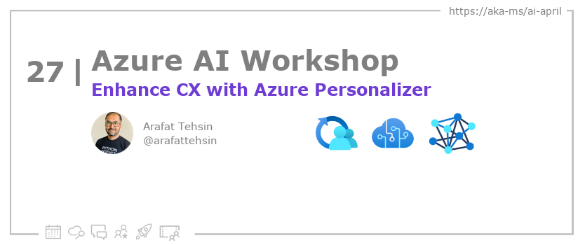
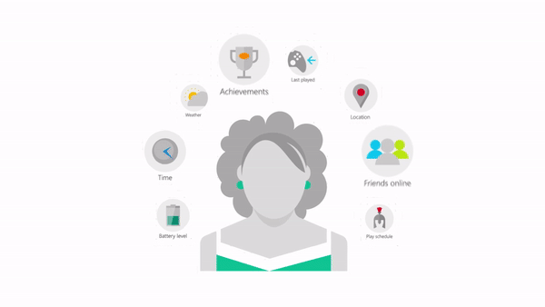
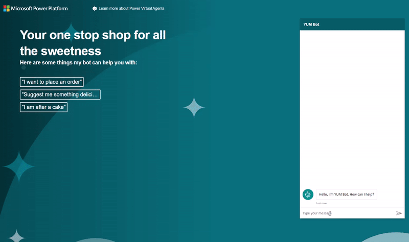

<head>

  <meta property="og:url" content="https://azureaidevs.github.io/hub/blog/2023-day27" />
  <meta property="og:title" content="Enhance CX with Azure Personalizer" />
  <meta property="og:description" content="Maximizing Business Results with Azure Personalizer: A Machine Learning-Based Service for Personalized Customer Experiences https://azureaidevs.github.io/hub/blog/2023-day27 #30DaysOfAzureAI #AzureAiDevs #AI #AzurePersonalizer" />
  <meta property="og:image" content="https://azureaidevs.github.io/hub/img/2023/banner-day27.png" />
  <meta property="og:type" content="article" />
  <meta property="og:site_name" content="Azure AI Developer" />

  <link rel="canonical" href="https://tbc"  />

</head>

- 📧 [Sign up for the Azure AI Developer Newsletter](https://aka.ms/azure-ai-dev-newsletter)
- 📰 [Subscribe to the #30DaysOfAzureAI RSS feed](https://azureaidevs.github.io/hub/blog/rss.xml)
- 📌 [Ask a question about this post on GitHub Discussions](https://github.com/AzureAiDevs/hub/discussions/categories/27-enhance-cx-with-azure-personalizer)
- 💡 [Suggest a topic for a future post](https://github.com/AzureAiDevs/hub/discussions/categories/call-for-content)

## 🗓️ Day _27_ of #30DaysOfAzureAI

<!-- README
The following description is also used for the tweet. So it should be action oriented and grab attention
If you update the description, please update the description: in the frontmatter as well.
-->

**Maximizing Business Results with Azure Personalizer: A Machine Learning-Based Service for Personalized Customer Experiences**

<!-- README
The following is the intro to the post. It should be a short teaser for the post.
-->

Yesterday we learned about the power of Stable Diffusion and Azure ML. Today, you're going to learn how to build personalized experiences for your customers with reinforcement learning using Azure Personalizer.

## 🎯 What we'll cover

<!-- README
The following list is the main points of the post. There should be 3-4 main points.
 -->

- Azure Personalizer Cognitive Service.
- Build a personalized experience for your users.
- How to create the resources for Azure Personalizer.

<!--
- Main point 1
- Main point 2
- Main point 3
- Main point 4
-->

<!-- README
Add or update a list relevant references here. These could be links to other blog posts, Microsoft Learn Module, videos, or other resources.
-->

## 📚 References

- [Azure Personalizer Cognitive Service](https://azure.microsoft.com/products/cognitive-services/personalizer?WT.mc_id=aiml-89446-dglover)
- [Azure Cognitive Services](https://azure.microsoft.com/en-au/products/cognitive-services/#overview?WT.mc_id=aiml-89446-dglover)
- [Azure Cognitive Services APIs](https://azure.microsoft.com/products/cognitive-services/#api?WT.mc_id=aiml-89446-dglover)
- [Case Study: VideoKen is improving video discovery and engagement using AI](https://startups.microsoft.com/blog/launchwithai-videoken?WT.mc_id=aiml-89446-dglover)

<!-- README
The following is the body of the post. It should be an overview of the post that you are referencing.
See the Learn More section, if you supplied a canonical link, then will be displayed here.
-->

## 🚌 Personalized user experiences at scale

Azure Personalizer is a cloud-based service offered by Microsoft Azure that enables developers to create personalized experiences for customers / users based on their preferences and behavior. By leveraging machine learning algorithms, Azure Personalizer can optimize personalized recommendations and actions to achieve the goals of the application, such as maximizing engagement or revenue. With its scalability and easy integration, it can be used to deliver tailored content and actions to a large number of users, providing a more engaging and satisfying user experience.

All in all, Azure Personalizer helps developers create personalized experiences for their users at scale, which can lead to increased user satisfaction and retention.

This [Azure Personalizer Workshop](https://www.arafattehsin.com/tag/azure-personalizer/) provides a comprehensive guide on how to create a personalized user experience using Azure Personalizer. The [first](https://www.arafattehsin.com/reinforcement-learning-in-apps-bots-websites-with-azure-personalizer-part-1/) part of the series introduces the necessary concepts of Azure Personalizer, including how it uses machine learning algorithms to optimize personalized recommendations and actions.

The [second](https://www.arafattehsin.com/reinforcement-learning-in-apps-bots-websites-with-azure-personalizer-part-2/) part of the series focuses on creating a simulator to create and improve a Personalizer model before deploying it to production. This allows developers to test and refine their model before launching it to a large number of users.

The [final](https://www.arafattehsin.com/reinforcement-learning-in-apps-bots-websites-with-azure-personalizer-part-3/) part of the series demonstrates how to use the Personalizer model in a Power Virtual Agents bot with the Power Automate custom connector.

By following the steps outlined in the workshop, developers can create a more engaging and personalized user experience that can lead to increased user satisfaction and retention.

## 👓 Read today's article

Today's [article](https://www.arafattehsin.com/reinforcement-learning-in-apps-bots-websites-with-azure-personalizer-part-3/).

## 🙋🏾‍♂️ Questions?

[Remember, you can ask a question about this post on GitHub Discussions](https://github.com/AzureAiDevs/Discussions/discussions/categories/27-enhance-cx-with-azure-personalizer)
