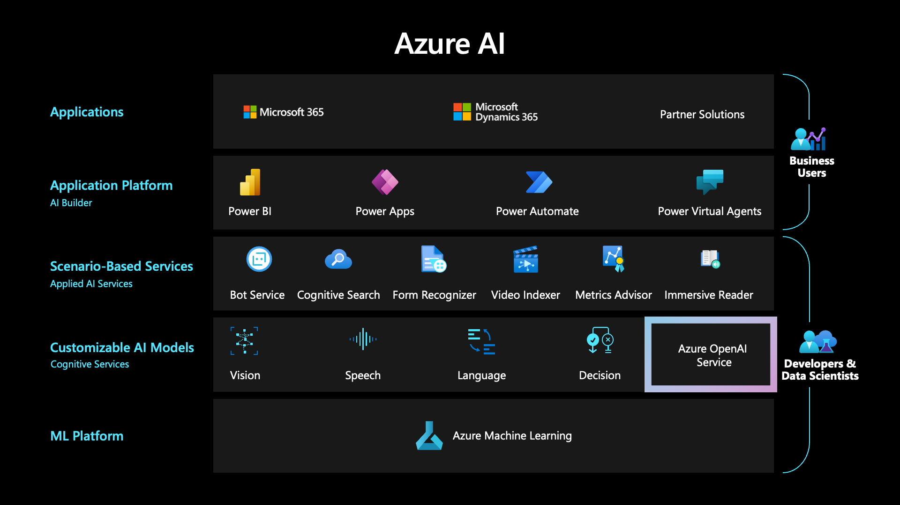
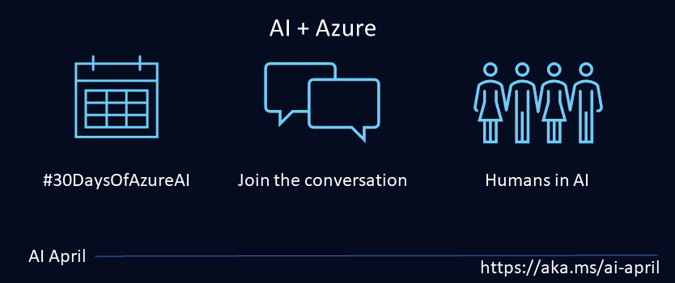
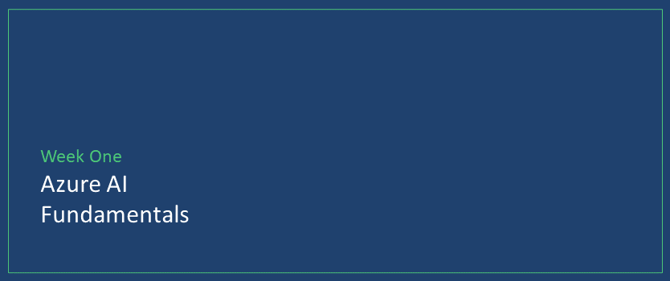
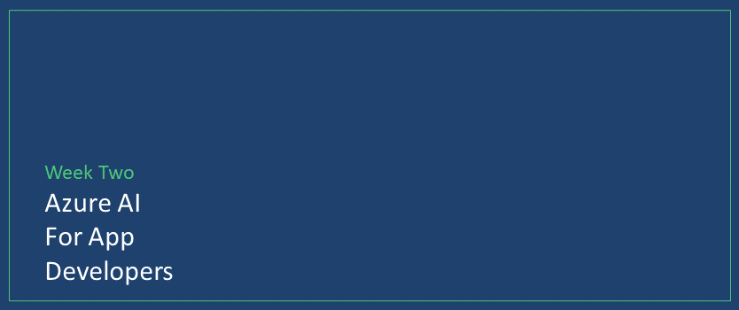
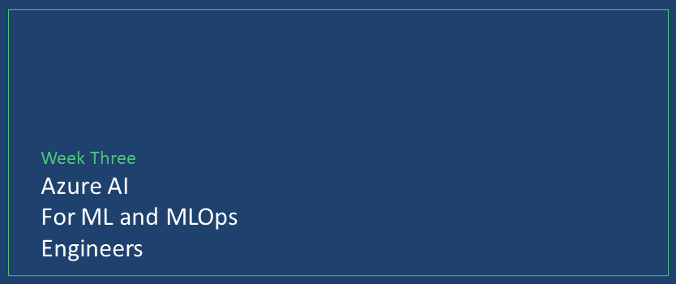
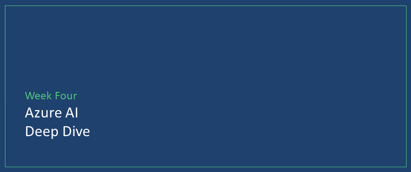
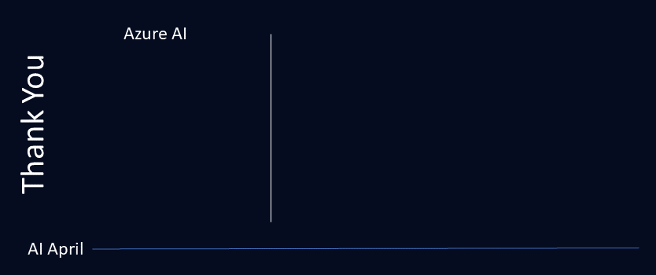

# Roadmap for #30Days

---

## Welcome

:::tip PLANNED ROADMAP
This is the planned roadmap for #30DaysOfAzureAI, a series of daily content posts all through #AiApril. Hear from our experts in the product teams, cloud advocacy, community and follow along at your own pace!
:::

We've organized the content into 4 themed weeks. Based on your role with the topic, you can choose specific weeks or posts to check out. If you are new to Azure AI development, we recommend you read the posts in order.

* **🏁 Fundamentals** of Azure OpenAI, Azure ML, and Responsible AI
* **👩‍💻 Build intelligent apps** with Azure AI Services and embedded app models
* **🧑🏽‍🔬 Building and managing ML models** with Azure ML, MLOps and Responsible AI
* **🏭 Workshop** your way through beginners content for Data Scientist, AL, ML, MLOps, and two cognitive services workshops.

---

## Kicking Off Azure AI Feb

_Welcome to our AI April kickoff!!_ The official kickoff is April 3 but we wanted to share a few posts ahead of time to set the context and describe the various resources available to you!

:::info Kick Off

* March 29 - [It's AI April!](/blog/2023-day1)

:::

---

## Week 1: Fundamentals

_Welcome to the Week 1 of your learning journey into Azure AI Development._

:::info Core Concepts & Developer Tools

_Posts will be linked here once published._

* April 03 – Microsoft AI leadership talk
* April 04 – Integrate Azure AI Services into Apps
* April 05 – Learn about the Azure OpenAI Playground
* April 06 – Introduction to Azure Machine Learning services
* April 07 – Why you should care about responsible AI

:::

---

## Week 2: Azure AI for App Developers

_Welcome to the Week 2 of your learning journey into Azure AI Development._

:::info Serverless, Data & Azure

_Posts will be linked here once published._

* April 10 – AI power your apps with Azure OpenAI and Cog Services SDKs
* April 11 – Extend your apps with the power of OpenAI and Cognitive Search
* April 12 – Build cross platform apps that integrate ML models with ONNX and .NET
* April 13 – On device inferencing in Excel with ONNX runtime and JavaScript
* April 14 – Learn about advances in developer productivity and GitHub CoPilot

:::

## Week 3. Azure AI for Data Scientists, AI, ML, and MLOps Engineers

_Welcome to the Week 3 of your learning journey into Azure AI Development._

:::info Component Frameworks & Customization

_Posts will be linked here once published._

* April 17 – Learn how to train and deploy in Azure ML
* April 18 – Learn how to train using Azure ML pipelines and components.
* April 19 – Learn how Azure Responsible AI services helps you build fairer models.
* April 20 – Introduction to MLOps
* April 21 - Fast track your MLOps with the MLOps accelerator.

:::

## Week 4: Workshops

_Welcome to the Week 4 of your learning journey into Azure AI Development._

:::info APP MANAGEMENT & DEVOPS

_Posts will be linked here once published._

* April 24 – You should care about accessibility and AI
* April 25 – Beginners content for Data Scientists, and AI and ML Engineers.
* April 26 - Patient registration made easy with AI services. Self-paced hands-on lab.
* April 27 – Humans in AI- Link off to Human’s in AI on the AI April community hub
* April 28 – Month: Recap

:::

<!-- ## Week 5: WRAP-UP

:::info SUMMARY OF #30DaysOfAzureAI
_Posts will be linked here once published._
 * Feb 27 - 🚀 Zero-To-Hero Post - API Management & Power Platform
 * Mar 1 - 🚀 Zero-To-Hero Post - Power Platform Pipelines
 * Mar 1 - Month: Recap
::: -->

Thank you for staying the course with us. In the final two posts of this series we'll do two things:

* **Look Back** - with a quick retrospective of what was covered.
* **Look Ahead** - with resources and suggestions for how you can skill up further!

We appreciate your time and attention and we hope you found this curated tour valuable. Feedback always welcome.

From our entire team, here's wishing you **good luck your learning & career journey!** 🎉
