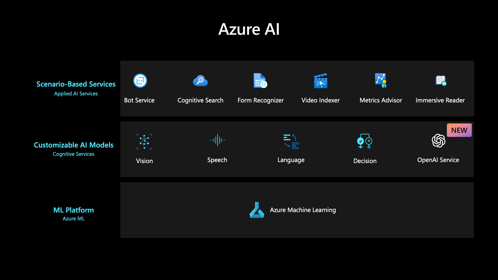
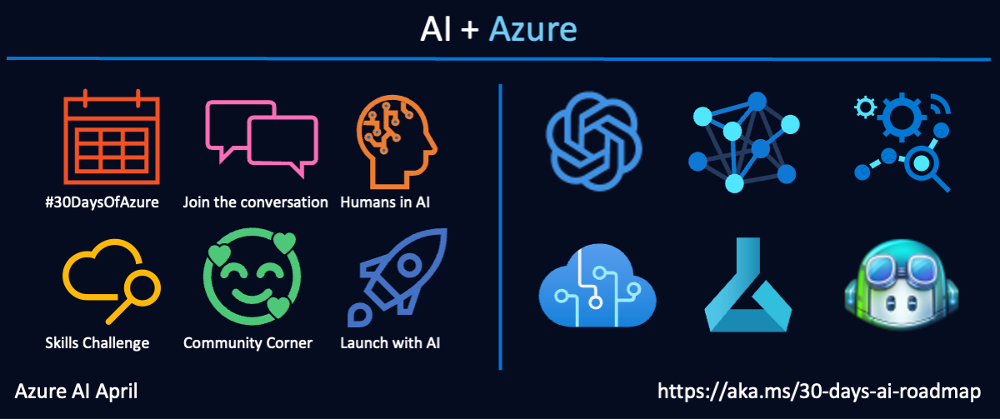
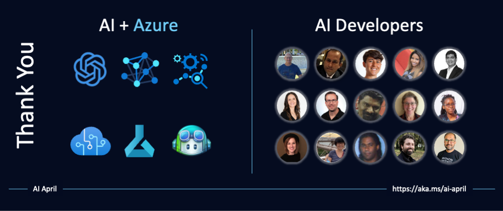

import Social from '@site/src/components/social';

<head>

<meta name="twitter:card" content="summary_large_image" />
<meta name="twitter:title" content="30 Days of Azure AI Roadmap" />
<meta name="twitter:description" content="📣 Calling all #AI developers! 🤖 Our #30DaysOfAzureAI roadmap is here https://aka.ms/30-days-ai-roadmap! Join us for a month-long journey covering #AzureOpenAI, #AzureML, #ResponsibleAI, #IntelligentApps and more. From fundamentals to advanced topics, there's something for everyone. Let's build the future of AI together! #AzureAiDevs #AzureAI" />
<meta name="twitter:image" content="https://azureaidevs.github.io/hub/img/2023-aia/campaign_banner.png" />

<meta property="og:url" content="https://aka.ms/30-days-ai-roadmap" />
<meta property="og:title" content="30 Days of Azure AI Roadmap" />
<meta property="og:description" content="📣 Calling all #AI developers! 🤖 Our #30DaysOfAzureAI roadmap is here https://aka.ms/30-days-ai-roadmap! Join us for a month-long journey covering #AzureOpenAI, #AzureML, #ResponsibleAI, #IntelligentApps and more. From fundamentals to advanced topics, there's something for everyone. Let's build the future of AI together! #AzureAiDevs #AzureAI" />
<meta property="og:image" content="https://azureaidevs.github.io/hub/img/2023-aia/campaign_banner.png" />
<meta property="og:type" content="article" />

</head>

# 30 Days Of Azure AI Roadmap

### Please share

<Social
    page_url="https://aka.ms/30-days-ai-roadmap"
    image_url="https://azureaidevs.github.io/hub/img/2023-aia/campaign_banner.png"
    title="30 Days of Azure AI Roadmap"
    description="📣 Calling all #AI developers! 🤖 Our #30DaysOfAzureAI roadmap is here! Join us for a month-long journey covering #AzureOpenAI, #AzureML, #ResponsibleAI, #IntelligentApps and more. From fundamentals to advanced topics."
    hashtags="AzureAiDevs,AzureAI"
    hashtag="#30DaysOfAzureAi"
/>

 

:::tip ROADMAP
This is the roadmap for #30DaysOfAzureAI, a series of daily content posts all through #AiApril. Hear from our experts in the product teams, cloud advocacy, community and follow along at your own pace! Where relevant, the daily posts have accompanying Open Source repositories, code samples, and other resources.
:::

We've organized the content into 4 themed weeks. Based on your role with the topic, you can choose specific weeks or posts to check out. If you are new to Azure AI development, we recommend you read the posts in order.

* **🏁 Fundamentals** of Azure OpenAI, Azure ML, AI for Accessibility, and Responsible AI. This week should be of interest to everyone
* **👩‍💻 Build intelligent apps** with Azure AI services like OpenAI and embedded ML models. This week is for app developers wanting to build intelligent apps using models or services trained by others.
* **🧑🏽‍🔬 Building and managing ML models** with Azure ML, MLOps and Responsible AI. This week is for Data Scientists, ML, or MLOps Engineers who build and manage ML models.
* **🏭 Workshop** your way through beginners content for Data Scientist, AL, ML, MLOps, and two cognitive services labs. This week is for everyone.

---

## Kicking Off Azure AI Feb

_Welcome to our AI April kickoff!!_ The official kickoff is April 3 but we wanted to share a few posts ahead of time to set the context and describe the various resources available to you!

:::info Kick Off

* [March 17 - 🎬 It's Azure AI April!](/2023-aia/day1)

:::

---

## Week 1: Fundamentals

_Welcome to the Week 1 of your learning journey into Azure AI Development._

:::info Azure AI for everyone

_Posts will be 404 Not Found until the day of publishing._

* [April 03 – 🏁 Unleash the power of Azure OpenAI](/2023-aia/day2)
* [April 04 – 🏁 Explore the Azure OpenAI Playground](/2023-aia/day3)
* [April 05 – 🏁 Build an AI receipts app with Copilot](/2023-aia/day4)
* [April 06 – 🏁 Learn key Azure ML Concepts](/2023-aia/day5)
* [April 07 – 🏁 The Mission of Responsible AI](/2023-aia/day6)
* [April 08 – 🏁 Improve accessibility with Azure AI](/2023-aia/day7)
* [April 09 – 🏁 Recap: Azure AI Fundamentals Week✨](/2023-aia/day8)

:::

---

## Week 2: Azure AI for App Developers

_Welcome to the Week 2 of your learning journey into Azure AI Development._

:::info Azure AI for App Developers

_Posts will be 404 Not Found until the day of publishing._

* [April 10 – 👩‍💻 Build intelligent apps with Azure AI SDKs](/2023-aia/day9)
* [April 11 – 👩‍💻 How to build your own ChatGPT](/2023-aia/day10)
* [April 12 – 👩‍💻 Cross-Platform AI with ONNX and .NET](/2023-aia/day11)
* [April 13 – 👩‍💻 Run BERT NLP models locally in Excel](/2023-aia/day12)
* [April 14 – 👩‍💻 Copilot's updated AI model](/2023-aia/day13)
* [April 15 – 👩‍💻 Blazor apps and Azure OpenAI](/2023-aia/day14)
* [April 16 – 👩‍💻 Recap: Azure AI for App Developers Week✨](/2023-aia/day15)

:::

## Week 3. Azure AI for Data Scientists, AI, ML, and MLOps Engineers

_Welcome to the Week 3 of your learning journey into Azure AI Development._

:::info Azure AI for Data Scientists, AI, ML, and MLOps Engineers

_Posts will be 404 Not Found until the day of publishing._

* [April 17 – 🧑🏽‍🔬 Scaling Model Dev with Azure ML](/2023-aia/day16)
* [April 18 – 🧑🏽‍🔬 Streamline Model Dev with Azure ML](/2023-aia/day17)
* [April 19 – 🧑🏽‍🔬 Azure ML Managed Online Endpoints](/2023-aia/day18)
* [April 20 – 🧑🏽‍🔬 Debug models with Responsible AI](/2023-aia/day19)
* [April 21 - 🧑🏽‍🔬 Streamline Ops with Azure MLOps](/2023-aia/day20)
* [April 22 – 🧑🏽‍🔬 Recap: Azure ML Week✨](/2023-aia/day21)

:::

## Week 4: Workshops

_Welcome to the Week 4 of your learning journey into Azure AI Development._

:::info Workshops

_Posts will be 404 Not Found until the day of publishing._

* [April 24 – 🏭 MLOps Accelerator Explained](/2023-aia/day22)
* [April 25 – 🏭 Data Science for Beginners](/2023-aia/day23)
* [April 26 - 🏭 Machine Learning for Beginners](/2023-aia/day24)
* [April 27 – 🏭 Build a Patient Registration App](/2023-aia/day25)
* [April 28 – 🏭 Stable Diffusion on Azure ML](/2023-aia/day26)
* [April 29 – 🏭 Enhance CX with Azure Personalizer](/2023-aia/day27)
* [April 30 – 🏭 Continuing your Azure AI Journey✨](/2023-aia/day28)

:::

Thank you for staying the course with us. In the final two posts of this series we'll do two things:

## Monthly Newsletter

If you haven't already, then register for the [Microsoft AI and Machine Learning Tech Newsletter](https://aka.ms/azure-ai-dev-newsletter).

We're also publishing an [AiMonthly](/hub/ai-update) blog with the latest Azure AI and Azure AI community news. If you want to share a project or an upcoming event, please [submit it here](https://github.com/AzureAiDevs/hub/discussions/categories/call-for-content).

The news will also be available via the [AiMonthly RSS feed](https://azureaidevs.github.io/hub/ai-update/rss.xml).

## Azure AI Skills Challenge

The [skills challenge](https://aka.ms/30-days-of-azure-ai-challenge) starts March 29th and is a self-guided learning experience to help you build your skills in Azure AI.

You'll learn key Azure AI technologies and earn points for completing the learning modules. You'll be able to see how you rank against other participants on the leaderboard.

The challenge is open to everyone, so feel free to share it with your friends and colleagues.

<!-- * **Look Back** - with a quick retrospective of what was covered.
* **Look Ahead** - with resources and suggestions for how you can skill up further! -->

## Thank you

We appreciate your time and attention and we hope you found this curated tour valuable. Feedback always welcome.

From our entire team, here's wishing you **good luck your learning & career journey!** 🎉
